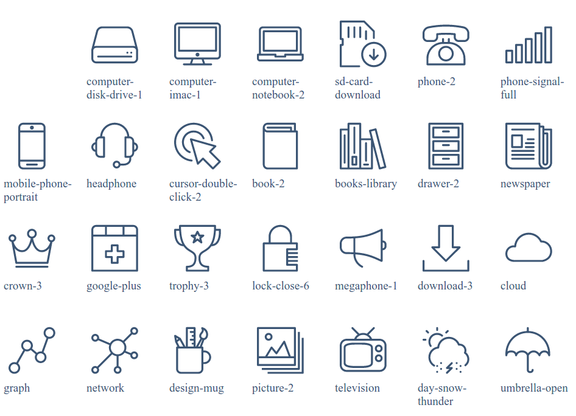
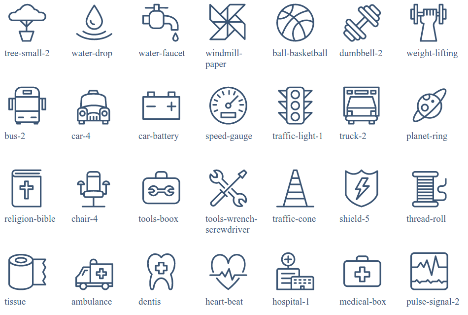
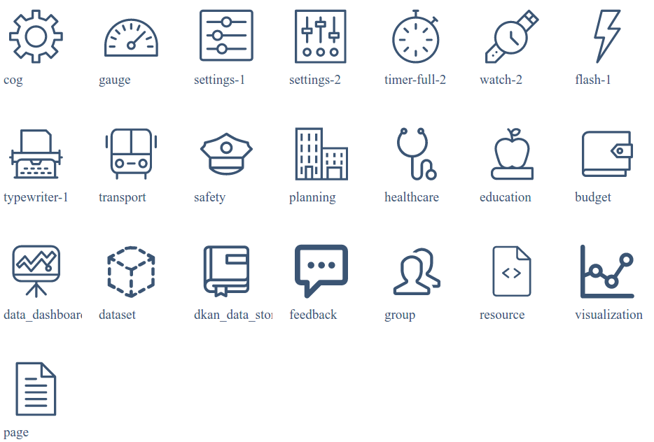

# Icons

## Front Page Icons

The front page icons are associated with a certain collection. To set the collection add the following in ``config.yml``:


```yml
front-page-icon-collection:
  - [COLLECTION]
front-page-icons:
 - [COLLECTION ITEM IDS]
```

For example:

```yml
front-page-icon-collection:
  - theme 
front-page-icons:
 - city-planning
 - finance-and-budgeting
 - health-care
 - public-safety
 - transporation
```

## Adding Icons to Collection Items
The actual icon types are added to the collection items with the ``icon`` key. For example:

```yml
title: 'City Planning'
identifier: city-planning
icon: building-12
```

## Available Icons

Below is the default icon list:







