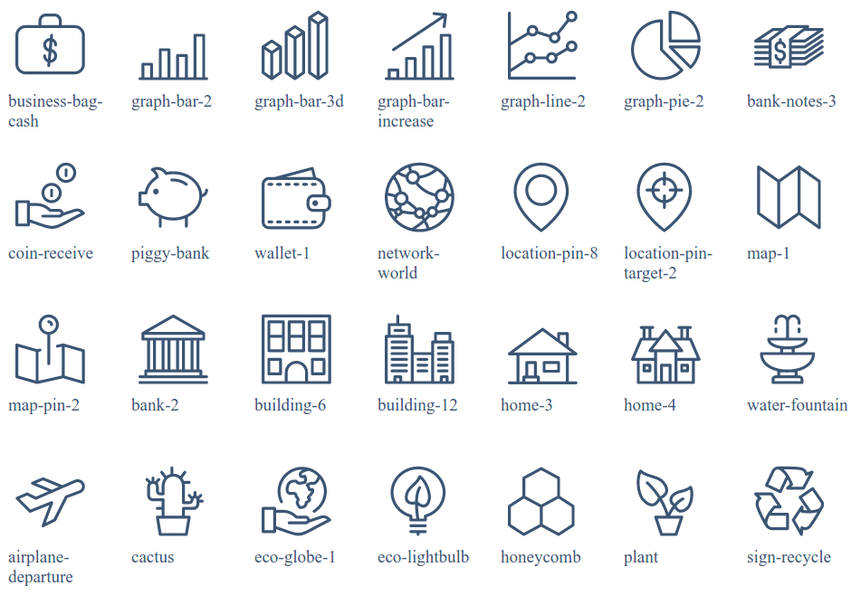
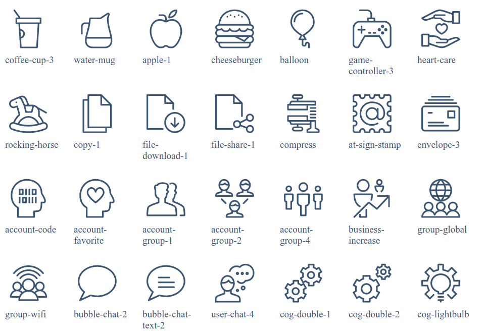

Configuration
--------

Search
========

This project supports the following backends:

* ElasticLunr
* ElasticSearch
* Javascript Search

The ElasticLunr and Javascript Search create a search index that is fully loaded by the client browser. This is ideal for small to midsized catalogs. Since there is no external search service or API to maintain costs and complexity are significantly lower. Since all the work is done in the browser search results are virtually instantaneous.

ElasticLunr has features consistent with search engines such as boosts, several parsing options, stopwords, and more. ElasticLunr file size is about one and a half times larger than the Javascript Search backend which just uses a filter on the datasets. The size of the index is a determining factor in which backend to use. The search index file size depends on how much data is included from each dataset and what fields are indexed. A catalog of 500 datasets might average 500kb gzipped using ElaticLunr and 200kb gzipped using Javascript Search.

ElasticSearch offers a full featured search backend. Currently _`facets need more work <https://github.com/interra/catalog-generate/issues/13>`_ for ElasticSearch.

Configuration
~~~~~~~~~~~

To configure the search set the following in ``config.yml``.  The exact types are ``ElasticLunr``, ``ElasticSearch`` and ``SimpleSearch`` (Javascript Search).

.. code-block:: yaml 
  search:
    type: simpleSearch
    fields:
      - title
      - keyword
      - publisher
      - description
      - theme
      - modified
      - distribution

For ElasticSearch include the ``endpoint:`` which should be the URL to the endpoint. ElasticSearch also requires the following in the ``private`` key in order to index correctly when using ``node cli.js build-search``:

.. code-block:: yaml 
  private:
    aws:
      accessKeyId:  
      secretAccessKey: 
      region:
      es: 
        endpoint: 
        index: 

Front Page Icons 
===============

The front page icons are associated with a certain collection. To set the collection add the following in ``config.yml``:

.. code-block:: yaml 
  front-page-icon-collection:
    - [COLLECTION]
  front-page-icons:
   - [COLLECTION ITEM IDS]

For example:

.. code-block:: yaml 
  front-page-icon-collection: theme 
  front-page-icons:
   - city-planning
   - finance-and-budgeting
   - health-care
   - public-safety
   - transporation

Adding Icons to Collection Items
~~~~~~~~~~~~~~~~~~~~~~~~~~~~~~~
The actual icon types are added to the collection items with the ``icon`` key. For example:

.. code-block:: json 

  {
    "title": "City Planning",
    "identifier": "city-planning",
    "icon": "building-12"
  }

Available Icons
~~~~~~~~~~~~~~

Below is the default icon list:

.. figure:: assets/fonts1.png

.. figure:: assets/fonts3.png

.. figure:: assets/fonts5.png

.. toctree::
   :maxdepth: 1

